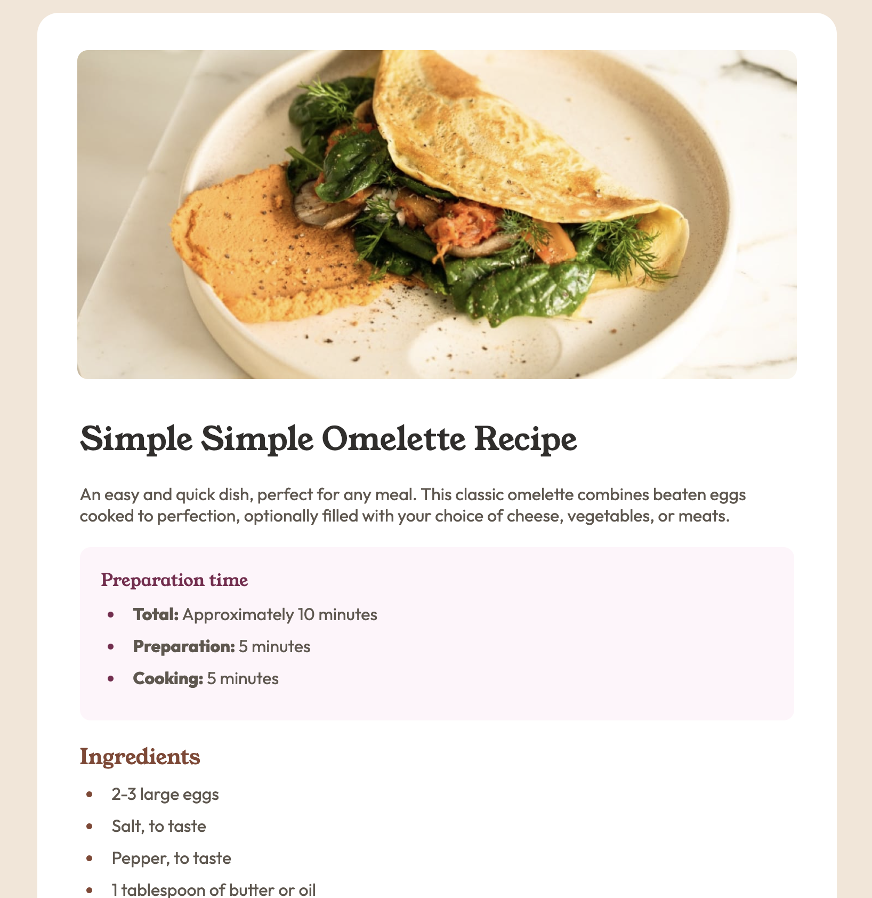

# Frontend Mentor - Recipe page solution

This is a solution to the [Recipe page challenge on Frontend Mentor](https://www.frontendmentor.io/challenges/recipe-page-KiTsR8QQKm). Frontend Mentor challenges help you improve your coding skills by building realistic projects.

## Table of contents

- [Overview](#overview)
  - [The challenge](#the-challenge)
  - [Screenshot](#screenshot)
  - [Links](#links)
- [My process](#my-process)
  - [Built with](#built-with)
- [Author](#author)

## Overview

### Screenshot

### Links

- Solution URL: [Solution](https://www.frontendmentor.io/solutions/recipe-page-zOvE5lv7Cd)
- Live Site URL: [Live page](https://funky-rcipe-page.netlify.app)

## My process

### Built with

- Semantic HTML5 markup
- CSS custom properties
- Flexbox
- Mobile-first workflow

## Author

- Linkedin - [Gurău Iulian](https://www.linkedin.com/in/gurău-iulian/)
- Frontend Mentor - [@giulian13](https://www.frontendmentor.io/profile/giulian13)
- GitHub - [@giulian13](https://github.com/giulian13/)
